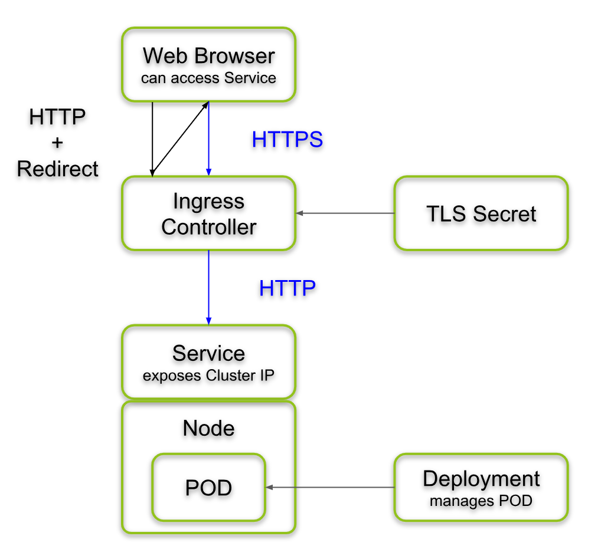

   * Minikube Kubernetes setup
      * 3 cluster nodes
      * Ingress using minikube addon
         * With wildcard DNS record resolving to the ip of Ingress node. Using BIND instead of Minikube addon ingress-dns   
      * Container registry
      * Local Docker, replace Docker Desktop
      * ArgoCD 

   * Target OS
      * MACOS Ventura 
         * 128G RAM, XEON E5-2696 v4 22 cores, 44 threads 

# Install
## Install packages on MACOS
```shell
brew install zsh minikube helm go kustomize cfssl yq k9s minio-mc
```

## Setup network/firewal on MACOS
   * Enable routing on MACOS
```shell
sudo sysctl -w net.inet.ip.forwarding=1
```
   * Enable firewall, enable bind 
     * System preference/Security & Privacy/Firewall Options 

## Install Minikube TLS CA certificate on MACOS
   * Go to directory "install/scripts/minikube-certs". Double-click "ca.crt" file and add certificate on "System"
   * Open "Keychain Access", click on "System", double-click "minikubeCA". 
      * On "Trust" set "Always Trust"
   * [Keychain Access screenshot](docs/MacOsKeyChainMinikubeCA.png)

## Install Minikube TLS CA certificate on Firefox
   * On Firefox URL type: about:preferences#privacy
      * Click "View Certificates"
         * On tab "Authorities" click "Import"
            * Select "ca.crt" file and click "Open"


### Conda Issue
   * https://docs.conda.io/projects/conda/en/latest/user-guide/configuration/non-standard-certs.html: CONDA, Using non-standard certificates
````shell
strace -f curl https://minio.minio-tenant-1.svc.cluster.local 2> /tmp/a
grep ssl /tmp/a
````
   * Conda doesn't use /etc/openssl! strace log:
```
openat(AT_FDCWD, "/opt/conda/envs/python_3_with_R/bin/../lib/./libssl.so.3", O_RDONLY|O_CLOEXEC) = 3
openat(AT_FDCWD, "/opt/conda/envs/python_3_with_R/ssl/openssl.cnf", O_RDONLY) = 3
openat(AT_FDCWD, "/opt/conda/envs/python_3_with_R/ssl/cacert.pem", O_RDONLY) = 6
write(2, "More details here: https://curl."..., 264More details here: https://curl.se/docs/sslcerts.html
```

   * Append Minikube CA certificate on "/opt/conda/envs/python_3_with_R/ssl/cacert.pem". "strace" works
   * "links" uses /etc/ssl directory
   * aws cli doesn't validate certificate
   * https://medium.com/@iffi33/dealing-with-ssl-authentication-on-a-secure-corporate-network-pip-conda-git-npm-yarn-bower-73e5b93fd4b2

### See also
   * https://minikube.sigs.k8s.io/docs/tutorials/custom_cert_ingress/: How to use custom TLS certificate with ingress addon
   * https://github.com/FiloSottile/mkcert: mkcert is a simple tool for making locally-trusted development certificates. It requires no configuration.


## Build and install management tool
```shell
brew install golang
```

```shell
GOPATH="$HOME/go"
export PATH=$PATH:"$GOPATH/bin"
```

```shell
mkdir -p $HOME/go

cd install/src
go get -u
go install
```

## Configure MACOS NFS server
   * /etc/exports
```
/Users/rogermm/git -alldirs -maproot=rogermm -network 192.168.64.0 -mask 255.255.255.0
/Volumes/data -alldirs -maproot=rogermm -network 192.168.64.0 -mask 255.255.255.0
/Users/rogermm/nfs -alldirs -maproot=rogermm -network 192.168.64.0 -mask 255.255.255.0
```

```commandlin
sudo nfsd enable
sudo nfsd checkexports
sudo nfsd restart
```

## NFS provisioner
```shell
kubectl get pods -n nfs-external-provisioner
```

```shell
kubectl logs -n nfs-external-provisioner nfs-subdir-external-provisioner-bf56599bc-m4rrq
```

# Kubernetes dashboard
   * https://dashboard.worldl.xpt/

# ArgoCD
   * https://argocd.world.xpt

# Rancher
   * Disabled, waiting Kubernetes 1.22 compatibility for RANCHER 2.6
   * https://rancher.world.xpt

# BIND
   * Restart service
```shell
sudo brew services restart bind
sudo brew  services info bind
```
   * Debugging
```shell
tail -f /usr/local/var/log/named/named.log
```
   * Getting MACOS dns configuration
```shell
scutil --dns
```

# Minikube ingress


# Post install checklist
## *.cluster.local dns lookups and service/pods connection on host
```shell
kubectl create namespace default
kubectl create deployment web --image=gcr.io/google-samples/hello-app:1.0 -n default
kubectl expose deployment web --type=NodePort --port=8080 -n default
```

```text
$ kubectl get svc/web
NAME   TYPE       CLUSTER-IP       EXTERNAL-IP   PORT(S)          AGE
web    NodePort   10.109.115.245   <none>        8080:32742/TCP   90s
```
   * Check dns cluster lookup
```shell
dig @10.96.0.10 kube-dns.kube-system.svc.cluster.local
dig @10.96.0.10 web.default.svc.cluster.local
```
   * Check TCP service/pod TCP connection
```shell
curl http://web.default.svc.cluster.local:8080
```

## Ingress dns lookups
```shell
minikube ip
ping anything.worldl.xpt
```

## Storage class
   * https://kubernetes.io/docs/tasks/administer-cluster/change-default-storage-class/

# Minikube Ingress TLS certificate
```shell
kubectl -n kube-system delete secret mkcert
```

```shell
kubectl -n kube-system create secret tls mkcert \
      --key  "$LABTOOLS/modules/minikube-labtools-k8s/install/scripts/ingress-certs/server-key.pem" \
      --cert "$LABTOOLS/modules/minikube-labtools-k8s/install/scripts/ingress-certs/server.crt"
```

   * _kube-system/mkcert_
```shell
minikube addons configure ingress
```
```shell
minikube addons disable ingress
minikube addons enable ingress
```

  * Verify if custom certificate was enabled
```shell
kubectl -n ingress-nginx get deployment ingress-nginx-controller -o yaml | grep "kube-system"
```

   * https://minikube.sigs.k8s.io/docs/tutorials/custom_cert_ingress/: How to use custom TLS certificate with ingress addon

# DNS
```shell
kubectx cluster
kubectl get svc --namespace=kube-system kube-dns
kubectx cluster2
kubectl get svc --namespace=kube-system kube-dns
```

   * Test DNS cluster 1
```shell
dig @10.112.0.10 www.google.com
```

* Test DNS cluster 2
```shell
dig @10.96.0.10 www.google.com
```

## BIND configuration


# Kubernetes NFS Sub-dir External Provisioner
## Uninstall
```shell
helm list
helm uninstall nfs-subdir-external-provisioner
```

# Hyperkit
   * https://stackoverflow.com/questions/59674804/how-to-list-vms-that-was-started-from-hyperkit

````shell
ps -Af | grep hyperkit
````

# Running on Linux

   * Install brew: https://brew.sh/

```text
macos:/Users/rogermm/git /Users/rogermm/git nfs auto 0 0
```

   * /etc/exports
```text
/Users/rogermm/git -alldirs -maproot=rogermm 192.168.100.8
```

```shell
sudo adduser --uid 501 --gid 20 mac
```

```shell
sudo podman network rm minikube
```

```shell
apt install curl git
```
   * https://asdf-vm.com/guide/getting-started.html#_3-install-asdf

```shell
export ASDF_DIR="$HOME/.asdf"
. "$HOME/.asdf/asdf.sh"
```

   * https://snapcraft.io/install/kubectx/ubuntu
```shell
sudo snap install kubectx --classic
```

```shell
wget https://github.com/ahmetb/kubectx/releases/download/v0.9.4/kubectx_v0.9.4_linux_x86_64.tar.gz
tar -zxf kubectx_v0.9.4_linux_x86_64.tar.gz
sudo install kubectx /usr/local/bin/

wget https://github.com/ahmetb/kubectx/releases/download/v0.9.3/kubens_v0.9.3_linux_x86_64.tar.gz
tar -zxf kubens_v0.9.3_linux_x86_64.tar.gz
sudo install kubens /usr/local/bin

```

```shell
minikube -p cluster2 service list
```

```text
|----------------------|------------------------------------|--------------|---------------------------|
|      NAMESPACE       |                NAME                | TARGET PORT  |            URL            |
|----------------------|------------------------------------|--------------|---------------------------|
| default              | kubernetes                         | No node port |                           |
| ingress-nginx        | ingress-nginx-controller           | http/80      | http://192.168.12.2:31631 |
|                      |                                    | https/443    | http://192.168.12.2:32188 |
| ingress-nginx        | ingress-nginx-controller-admission | No node port |                           |
| kube-system          | kube-dns                           | No node port |                           |
| kube-system          | metrics-server                     | No node port |                           |
| kube-system          | registry                           | No node port |                           |
| kubernetes-dashboard | dashboard-metrics-scraper          | No node port |                           |
| kubernetes-dashboard | kubernetes-dashboard               | No node port |                           |
|----------------------|------------------------------------|--------------|---------------------------|
```

```shell
(
  set -x; cd "$(mktemp -d)" &&
  OS="$(uname | tr '[:upper:]' '[:lower:]')" &&
  ARCH="$(uname -m | sed -e 's/x86_64/amd64/' -e 's/\(arm\)\(64\)\?.*/\1\2/' -e 's/aarch64$/arm64/')" &&
  KREW="krew-${OS}_${ARCH}" &&
  curl -fsSLO "https://github.com/kubernetes-sigs/krew/releases/latest/download/${KREW}.tar.gz" &&
  tar zxvf "${KREW}.tar.gz" &&
  ./"${KREW}" install krew
)
```

   * https://k9scli.io/topics/install/
```shell
sudo snap install k9s
```

```shell
sudo apt install bind9-utils
```

## MAC OS configuration
```shell
sudo route -n add -net 192.168.11.0/24 192.168.100.8
sudo route -n add -net 192.168.12.0/24 192.168.100.8
```

```shell
netstat -anr | grep 192.168.11
netstat -anr | grep 192.168.12
```


   * https://github.com/kubernetes/minikube/pull/9404: Add new flag "--ports" to expose ports for docker & podman drivers

# Minikube
```shell
kubectx cluster1
kubectl get node cluster1 -o jsonpath='{.status.capacity}'
```

```shell
kubectx cluster2
kubectl get node cluster2 -o jsonpath='{.status.capacity}'
kubectl get node cluster2-m02 -o jsonpath='{.status.capacity}'
kubectl get node cluster2-m03 -o jsonpath='{.status.capacity}'
```

# NFS
```shell
sudo nfsd status
```

```shell
sudo nfsd enable
sudo nfsd start
```

```shell
sudo nfsd update
```

```shell
showmount -e
```

# See also
   * [How to make ingress certificate](docs/HowToMakeIngressCertificate.md)
   * [Jetbrains configuration](docs/Jetbrains.md)

# References
   * https://argo-cd.readthedocs.io/en/stable/getting_started/
   * https://rancher.com/docs/rancher/v2.5/en/installation/install-rancher-on-k8s
   * https://www.youtube.com/watch?v=_pUXOn_VRdQ: Nginx Ingress Controller Minikube with dnsmasq
   * https://gist.github.com/davebarnwell/c408533d608bfe24f4f5: Install dnsmasq and configure for *.dev.local domains
   * https://gist.github.com/loa/a88803c5678381eb515ab7f1241199a3: Minikube host networking integration
   * https://kubernetes.io/docs/concepts/storage/volumes/#local:
   * https://vocon-it.com/2018/12/31/kubernetes-6-https-applications-via-ingress-controller-on-minikube/: Kubernetes (6) – HTTPS Applications via Ingress Controller on Minikube 
   * https://www.suse.com/support/kb/doc/?id=000016445: Name Resolution Problems with ".local" Domains
   * https://techexpertise.medium.com/minikube-multi-node-k8s-cluster-with-shared-nfs-mount-pv-cb3105f9a2c7: Minikube Multi-Node K8s Cluster with Shared NFS mount PV