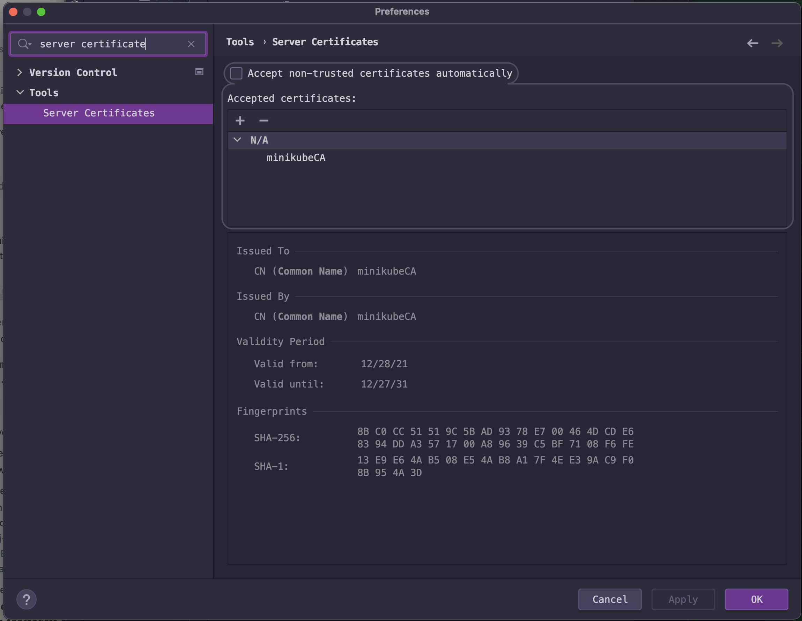

# Add CA certificate
   * Add Minikube CA certificate using script

   * Jetbrains manual instalation
```shell
cd install/scripts
./jetbrains-manual-add-certificate.sh
```

   * Jetbrains toolbox instalation 
```shell
cd install/scripts
./jetbrains-toolbox-add-certificate.sh
```

   * Add Minikube CA certificate using Jetbrains GUI "Preferences/Tools/Server Certificates"
      * Certificate located on "$MINIKUBE_HOME/ca.crt" or repository "install/scripts/minikube-certs/ca.crt" 

