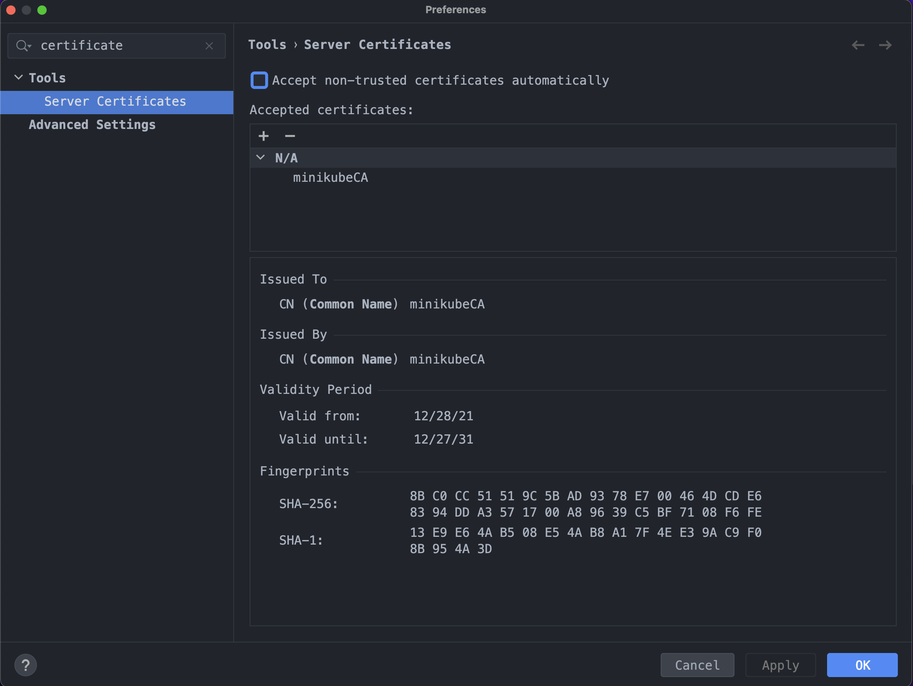

   * Add Minikube Ca certificate using script
```text
Run script "install/scripts/jetbrains-add-certificate.sh" or
```

   * Add Minikube Ca certificate using Jetbrains GUI Preferences/Tools/Server Certificates
      * Certificate located on "$MINIKUBE_HOME/ca.crt" or on repository "install/scripts/minikube-certs/ca.crt" 

